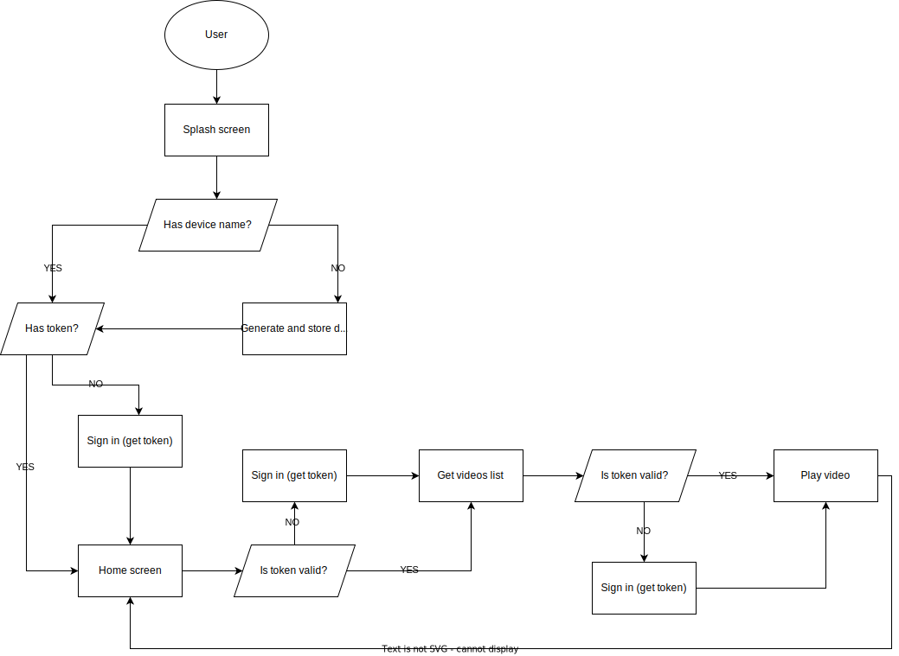

# Solution of a Better Software Group - React platform - Task 1

## MAIN GOAL

The goal of this task was to make an OTT web application containing video content with the option of playback.

## HOW TO RUN

In the project directory, you can run:

```
npm start
```

It runs the app in the development mode.
By default if starts on port 3000, but if it is already taken different port will be assigned.
Please make sure the app is running on port 3000, otherwise there will be CORS problems when polling the API.

## DONE:

##### 1. Splash screen

- Authorize and login as Anonymous user
- Redirect to Home screen
- Show error message if something went wrong

##### 2. Home (main) screen

- Get the list of media (videos, titles and images)
- Display media on a list with scroll possibility
- Redirect to Player screen after clicking on list item or Play button of featured video
- Featured video is a static placeholder, redirection is always made to the same video
- Show error message if something went wrong

##### 3. Player screen

- Display player
- Show error message if something went wrong

## IMPROVE:

1. Write tests
2. Use TypeScript
3. Add second list with video content
4. Add a login screen and functionality for registered users
5. Handle responsive views
6. Handle internationalisation and localisation
7. Change the paths in `<Route path=""/>` components and `navigate()` functions to be generated dynamically i.e. save all paths in one place and take them during the building of an app (not hardcode paths as it is right now).
8. Sometimes there are problems with playing the videos (specially on mobile view). It is not clear what is the reason - the player library itself or the API. When the problem occurs, the error message is displayed.

## INFO:

To display images in 16:9 aspect ratio, CSS `aspect-ratio` property was used. According to [documentation](https://developer.mozilla.org/en-US/docs/Web/CSS/aspect-ratio) it is not supported in every browser.
Another way to set aspect ratio of an image is to use ['Padding-Top Hack'](https://www.gavsblog.com/blog/change-the-aspect-ratio-of-an-image-using-css#:~:text=The%20premise%20is%20that%20we,to%20adjust%20the%20aspect%20ratio.&text=For%20a%2016%3A9%20aspect,us%20a%20padding%20of%2056.25%25.).

## FLOW DIAGRAM:

